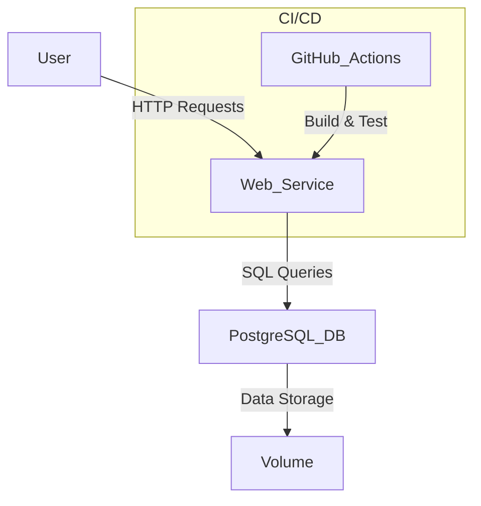

# Hello DevOps: A Containerized Flask and PostgreSQL Application

## Table of Contents

- [Overview](#overview)
- [Features](#features)
- [Architecture](#architecture)
- [Getting Started](#getting-started)
  - [Prerequisites](#prerequisites)
  - [Running the Application](#running-the-application)
- [Usage](#usage)
  - [API Endpoints](#api-endpoints)
- [Testing](#testing)
- [Configuration](#configuration)
- [CI/CD](#ci/cd)
- [Contributing](#contributing)
- [License](#license)

## Overview

This project provides a minimal yet comprehensive example of a DevOps workflow for a web application. It features a Python Flask backend, a PostgreSQL database, and integration tests, all orchestrated using Docker Compose. This setup ensures a consistent development, testing, and deployment environment, making it an ideal starting point for understanding containerized application development and continuous integration practices.

## Features

- **Web Service**: A Flask application exposing a simple REST API.
- **Database**: PostgreSQL for robust data persistence, initialized with a predefined schema and seed data.
- **Containerization**: All services are Dockerized for environment consistency and isolation.
- **Orchestration**: Local development and testing environments are seamlessly managed with Docker Compose.
- **Testing**: Comprehensive integration tests are implemented using `pytest` to ensure application reliability.

## Architecture

The application's architecture is composed of two primary services: a Flask web application and a PostgreSQL database. These services interact as depicted in the diagram below, with GitHub Actions providing automated CI/CD capabilities.



## Getting Started

To get this application up and running on your local machine, follow these steps.

### Prerequisites

Ensure you have the following software installed:

- [Docker](https://docs.docker.com/get-docker/): For containerizing the application services.
- [Docker Compose](https://docs.docker.com/compose/install/): For defining and running multi-container Docker applications.

### Running the Application

1.  **Clone the repository:**

    ```bash
    git clone git@github.com:daretechie/hello-devops.git
    cd hello-devops
    ```

2.  **Build and start the services:**
    ```bash
    docker compose up --build -d
    ```
    The `-d` flag runs the services in detached mode.

The web service will be accessible at `http://localhost:5000`.

## Usage

### API Endpoints

The Flask application exposes the following REST API endpoints:

- `GET /`: Returns a simple welcome message.
- `GET /health`: Provides the health status of the application, useful for readiness probes.
- `GET /users`: Retrieves a list of users from the PostgreSQL database.

## Testing

Automated tests are crucial for maintaining the quality and reliability of the application. This project includes integration tests that cover the Flask application's functionality and its interaction with the database.

To execute the test suite, ensure your Docker Compose services are running (as described in "Running the Application"), then run the following command:

```bash
pytest -q
docker compose exec web pytest -q
```

This will run the integration tests for the Flask application and database connectivity.

## Configuration

The application can be configured using the following environment variables. Defaults are provided in `app.py`.

| Variable      | Description       | Default     |
| ------------- | ----------------- | ----------- |
| `DB_HOST`     | Database host     | `localhost` |
| `DB_NAME`     | Database name     | `devopsdb`  |
| `DB_USER`     | Database username | `postgres`  |
| `DB_PASSWORD` | Database password | `password`  |

When running with Docker Compose, these variables are set in the `docker-compose.yml` file.

## CI/CD

A basic CI pipeline is configured in `.github/workflows/ci.yml` to automatically run tests on push and pull requests.

## Contributing

Contributions are welcome. Please open an issue to discuss any major changes or submit a pull request with your improvements.

## License

This project is unlicensed. You are free to use it as you see fit.
